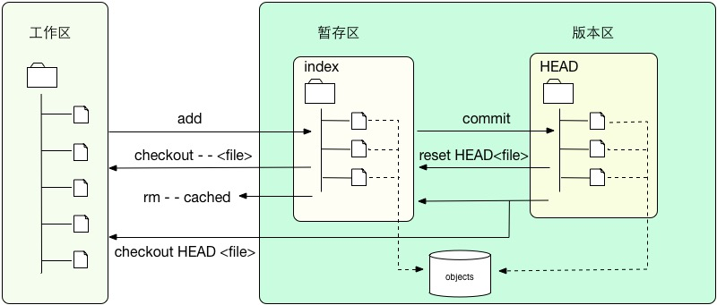

# 前言
在工作中每天都使用git,拉取代码命令、提交本地仓库命令、merge代码命令、提交远程仓库命令是经常用到的,但是这只是git命令的冰山一角,当然git只是一个管理代码的工具,这篇文章我想系统的完整的了解一遍git的细节,并不局限上面的常用的命令,当然我会参考一些网络文章我会在README.md文件中设置链接供大家参考,当然如果有不正确的地方希望可以给我指出

## git的工作原理

<div align="center">

  
  
  <br/>
  
  

</div>

- 文件的三个区域

  - 工作区 (本地文件)
  - 暂存区 (缓存区域，临时保存你的改动)
  - 版本区 (版本区，它指向你最后一次提交的结果)

## git 初始化

初始化仓库这一步骤是在github创建仓库之后需要进行的操作,但是现在很多做git的仓库管理的网站已经简化了这一个步骤直接按照网站对应的操作进行创建即可,在这里我们赢github的创建步骤举例
1. 首先我们在github创建仓库(按照创建步骤创建即可).
2. 创建好之后我们需要将仓库拉取到本地.
3. 初始化仓库

代码如下:
```angular2html
  // 拉取代码命令
  git clone '仓库url'
  // 初始化仓库命令
  git init
```